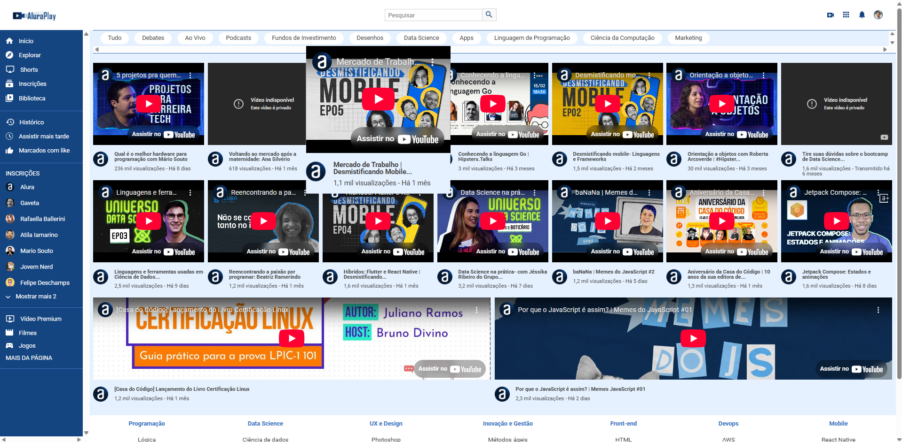

# 📺 AluraPlay

Uma plataforma de vídeos educacionais inspirada na interface do YouTube, desenvolvida com **HTML** e **CSS**, como parte dos cursos da [Alura](https://www.alura.com.br/). O objetivo é reforçar conceitos de **semântica HTML**, **responsividade**, e **componentização visual**.



## 🚀 Funcionalidades

- Navegação por menu lateral
- Filtro de vídeos por categoria
- Visualização de cards com título, thumbnail e autor
- Layout responsivo
- Estilo inspirado no YouTube com customização Alura

## 🛠️ Tecnologias Utilizadas

- HTML5
- CSS3
- Flexbox
- Grid Layout
- Responsividade Mobile-first

## 📂 Como rodar o projeto

1. Clone o repositório:
   ```bash
   git clone https://github.com/seu-usuario/aluraplay.git
   ```
2. Acesse a pasta do projeto:
   ```bash
   cd aluraplay
   ```
3. Abra o `index.html` no seu navegador.

## 🧠 Aprendizados

Durante esse projeto, pratiquei a estruturação semântica de páginas com HTML e estilos avançados com CSS, principalmente Flexbox e Grid, além de aplicar boas práticas de organização de arquivos e responsividade.

## 👩‍💻 Sobre mim

Desenvolvido por **Stefany Batista**  
🎓 Estudante de Sistemas de Informação | Entusiasta em Dados, Desenvolvimento e Inteligência Artificial 
📍 Uberlândia, MG  
📎 [LinkedIn](https://www.linkedin.com/in/stefanybrauns)
